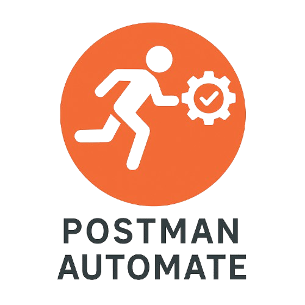
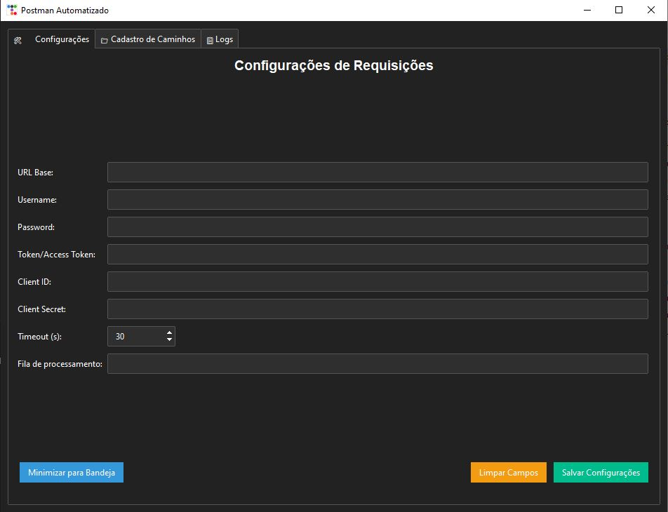
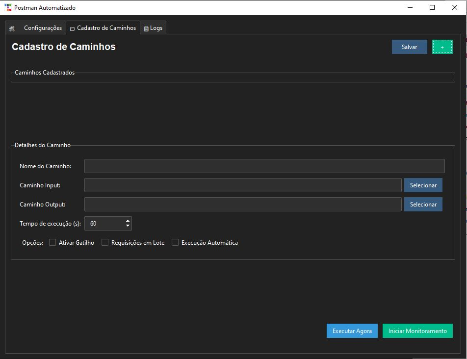
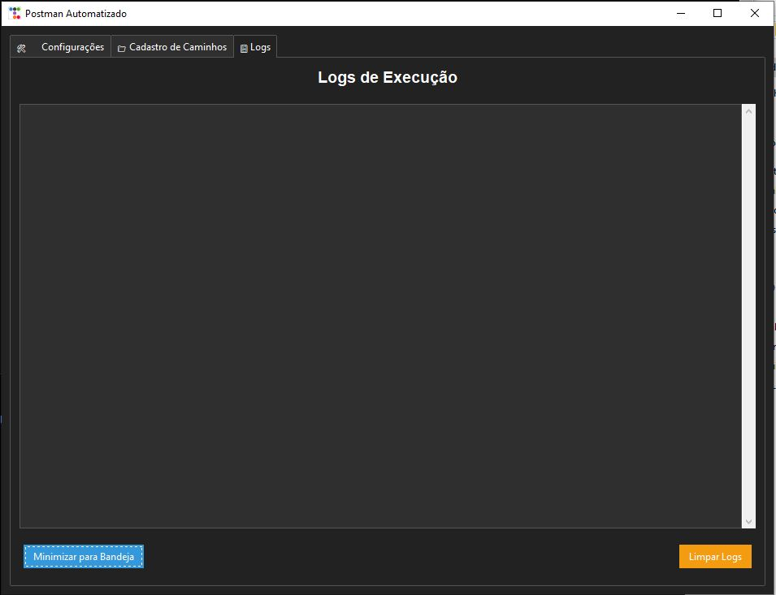

# Postman Automatizado

<p align="center">
  
</p>

Um aplicativo de desktop desenvolvido em Python com ttkbootstrap que funciona como um Postman automatizado para envio de requisições HTTP em lote. Ideal para integração com sistemas que necessitam de processamento de arquivos JSON em massa.

## 📋 Visão Geral

O Postman Automatizado é uma ferramenta que permite o envio automatizado de requisições HTTP a partir de arquivos JSON. O sistema monitora uma pasta de entrada, processa os arquivos encontrados e envia cada um como uma requisição POST para um endpoint configurado.

### Principais Recursos

- 🌙 Interface gráfica moderna com tema escuro
- ⚙️ Configuração flexível de parâmetros de requisição
- 🔄 Monitoramento automático de diretórios
- 🚀 Processamento em lote ou individual
- 🔔 Suporte a gatilhos de início e fim de processamento
- 📊 Logs detalhados de execução
- 🕒 Execução manual ou automática via monitoramento
- 🔒 Suporte a diferentes métodos de autenticação

## 🖼️ Capturas de Tela

### Configurações

<p align="center">
  
</p>

### Cadastro de Caminhos

<p align="center">
  
</p>

### Logs

<p align="center">
  
</p>

## 🔧 Requisitos

- Python 3.6 ou superior
- Bibliotecas: ttkbootstrap, requests, watchdog, PIL

## 📥 Instalação

### Método 1: Usando o código-fonte

1. Clone ou baixe este repositório
2. Instale as dependências:

```bash
pip install -r requirements.txt
```

3. Execute o aplicativo:

```bash
python postman_automatizado.py
```

### Método 2: Usando o executável

1. Baixe a versão mais recente do executável
2. Execute o arquivo `Postman_Automatizado.exe`

Alternativamente, você pode criar seu próprio executável:

1. Execute o arquivo `criar_executavel.bat`
2. Aguarde o processo ser concluído
3. O executável será criado na pasta `dist`

## 📚 Como Usar

### Aba de Configurações

Preencha os campos necessários para suas requisições:

- **URL Base**: URL principal para onde as requisições serão enviadas
- **Username/Password**: Credenciais para autenticação básica
- **Token/Access Token**: Token de autenticação (Bearer)
- **Client ID/Secret**: Credenciais para OAuth (se necessário)
- **Timeout**: Tempo limite para cada requisição em segundos
- **Fila de processamento**: Número de requisições simultâneas (para processamento em lote)

Clique em "Salvar Configurações" para armazenar os dados.

### Aba de Cadastro de Caminhos

- **Caminho Input**: Diretório onde os arquivos JSON a serem processados serão colocados
- **Caminho Output**: Diretório onde os arquivos processados serão movidos
- **Tempo de execução**: Intervalo em segundos para verificação automática da pasta de entrada
- **Ativar Gatilho**: Se marcado, o processamento só iniciará quando um arquivo `gatilho_ini.json` for detectado
- **Requisições em Lote**: Se marcado, as requisições serão enviadas simultaneamente
- **Execução Automática**: Se marcado, o sistema verificará a pasta de entrada periodicamente

Clique em "Salvar Caminhos" para armazenar as configurações.

### Monitoramento e Execução

- **Iniciar Monitoramento**: Começa a monitorar o diretório de entrada para novos arquivos
- **Executar Agora**: Processa imediatamente todos os arquivos JSON no diretório de entrada
- **Parar Monitoramento**: Interrompe o monitoramento ativo

## 🔄 Modos de Operação

### Modo de Monitoramento Automático com Gatilho

1. Configure os caminhos de entrada e saída
2. Marque a opção "Ativar Gatilho"
3. Clique em "Iniciar Monitoramento"
4. Coloque os arquivos no diretório de entrada:
   - `gatilho_ini.json` (para iniciar o processamento)
   - Arquivos JSON a serem processados
   - `gatilho_fim.json` (será enviado ao final)

### Modo de Execução Automática Periódica

1. Configure os caminhos de entrada e saída
2. Defina o tempo de execução em segundos
3. Marque a opção "Execução Automática"
4. Clique em "Iniciar Monitoramento"
5. O sistema verificará a pasta de entrada no intervalo definido

### Modo de Processamento em Lote

1. Configure os caminhos de entrada e saída
2. Defina um valor numérico no campo "Fila de processamento"
3. Marque a opção "Requisições em Lote"
4. Ao processar, o sistema enviará múltiplas requisições simultaneamente

### Modo de Execução Manual

1. Configure os caminhos de entrada e saída
2. Coloque os arquivos JSON a serem processados no diretório de entrada
3. Clique em "Executar Agora"

## 📁 Estrutura dos Arquivos JSON

### Arquivos de Gatilho

#### gatilho_ini.json
```json
{
    "tipo": "inicio",
    "timestamp": "2023-01-01T00:00:00",
    "mensagem": "Iniciando processamento de lote",
    "lote_id": "LOTE001"
}
```

#### gatilho_fim.json
```json
{
    "tipo": "fim",
    "timestamp": "2023-01-01T00:00:00",
    "mensagem": "Finalizando processamento de lote",
    "lote_id": "LOTE001",
    "total_processado": 10,
    "status": "concluido"
}
```

### Arquivos de Requisição

Qualquer arquivo JSON válido pode ser usado como corpo da requisição. Exemplo:

```json
{
    "id": "REQ001",
    "data": "2023-01-01",
    "cliente": {
        "nome": "Empresa Exemplo",
        "codigo": "EMP001",
        "documento": "12345678901234"
    },
    "itens": [
        {
            "codigo": "PROD001",
            "descricao": "Produto de Exemplo 1",
            "quantidade": 5,
            "valor_unitario": 10.50
        },
        {
            "codigo": "PROD002",
            "descricao": "Produto de Exemplo 2",
            "quantidade": 2,
            "valor_unitario": 25.75
        }
    ],
    "valor_total": 104.00,
    "observacoes": "Esta é uma requisição de exemplo."
}
```

## 📊 Monitorando o Processamento

A aba de Logs exibe informações detalhadas sobre o processamento:

- Status de cada requisição enviada
- Erros que possam ocorrer
- Confirmação de arquivos processados
- Timestamps de início e fim de processamento

## 💡 Dicas e Solução de Problemas

### Configuração
- Certifique-se de que os diretórios de entrada e saída existam antes de iniciar o monitoramento
- Verifique se a URL base está correta e acessível
- Se estiver usando autenticação, confirme se as credenciais estão corretas

### Processamento em Lote
- Para o processamento em lote funcionar corretamente, o valor da "Fila de processamento" deve ser um número inteiro
- Quanto maior o número de requisições simultâneas, maior será o consumo de recursos do sistema
- Recomenda-se ajustar o valor de acordo com a capacidade do seu sistema e da API de destino

### Execução Automática
- O tempo de execução define o intervalo em segundos entre as verificações da pasta de entrada
- Valores muito baixos podem sobrecarregar o sistema e a API de destino
- Valores recomendados: entre 30 e 300 segundos (0,5 a 5 minutos)

### Geral
- Os arquivos são processados em ordem alfabética pelo nome
- Após o processamento, os arquivos são movidos para o diretório de saída com um timestamp no nome
- Se ocorrerem erros nas requisições, verifique os logs para mais detalhes
- Para interromper o monitoramento, clique em "Parar Monitoramento"

## 📄 Licença

Este projeto está licenciado sob a licença MIT - veja o arquivo LICENSE para detalhes.

## 📞 Suporte

Se encontrar problemas ou tiver sugestões, por favor, abra uma issue no repositório do GitHub.
